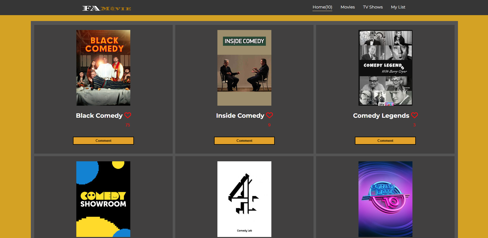

# 📗 Table of Contents

- [📖 About the Project](#about-project)
  - [🛠 Built With](#built-with)
    - [Tech Stack](#tech-stack)
    - [Key Features](#key-features)
  - [🚀 Live Demo](#live-demo)
- [💻 Getting Started](#getting-started)
- [👥 Authors](#authors)
- [⭐️ Show your support](#support)
- [📝 License](#license)

<!-- PROJECT DESCRIPTION -->

# 📖 FAMovie 

> This is a demo project illustrating a movie app. The app list out the movies that one can comment on it and like it. It loads diffrent movies eaach time the user reloads the page.

## 🛠 Built With 

### Tech Stack 

  
Languages

  <ul>
    <li>Html/CSS</li>
    <li>JavaScript</li>
    <li>Frameworks JEST</li>
    <li>Technologies used Javascript webpack</li>
  </ul>

<!-- Features -->
 

### Key Features 

- **Connect to the FAMovie API**
- **"Like" and "Comment" Functions**
- **Async & await operations**

(<a href="#readme-top">back to top</a>)

<!-- LIVE DEMO -->

## 🚀 Live Demo 

- [Live Demo Link](https://alabi12.github.io/capstone-project-JavaScript/dist)

(<a href="#readme-top">back to top</a>)

<!-- GETTING STARTED -->

## 💻 Getting Started 

<ul>
  <li>Get a copy of the project</li>
  <li>Come into the project directory</li>
  <li>Open the project using code editor of your choice</li>
  <li>Open your prefered browser</li>
</ul>

(<a href="#readme-top">back to top</a>)

## 👥Assessment Video Links 

[Robert's Video Presentation](https://drive.google.com/file/d/1XDqDPsHlIblEHW4fTzsDZ2iw5vmcahP1/view?usp=share_link)

[Fuad's Video Presentation](https://drive.google.com/file/d/1dIkmLdwLuuxJFlXuyXn0T9jEITjzKjNn/view?usp=share_link)

<!-- AUTHORS -->

## 👥 Authors 

👤 **Fuad Nabiyev**

- GitHub: [FuadNabi](https://github.com/FuadNabi)
- Twitter: [FuadNebiyev2](https://twitter.com/FuadNebiyev2)
- LinkedIn: [FuadNabiyev](https://www.linkedin.com/in/fuad-nabiyev-a5234524a/)

👤 **Robert Alabi**

- GitHub: [@githubhandle](https://github.com/Alabi12)
- Twitter: [@twitterhandle](https://twitter.com/wolo_robert)
- LinkedIn: [LinkedIn](https://linkedin.com/in/robert-alabi)

(<a href="#readme-top">back to top</a>)

<!-- FUTURE FEATURES -->

(<a href="#readme-top">back to top</a>)

<!-- CONTRIBUTING -->

## 🤝 Contributing 

Contributions, issues, and feature requests are welcome!

Feel free to check the [issues page](https://github.com/Alabi12/capstone-project-JavaScript/issues).

(<a href="#readme-top">back to top</a>)

<!-- SUPPORT -->

## ⭐️ Show your support 

Give a **Star** if you like this project!

(<a href="#readme-top">back to top</a>)

<!-- LICENSE -->

## 📝 License 

This project is [MIT](https://github.com/Alabi12/capstone-project-JavaScript/blob/dev/LICENSE) licensed.

(<a href="#readme-top">back to top</a>)

